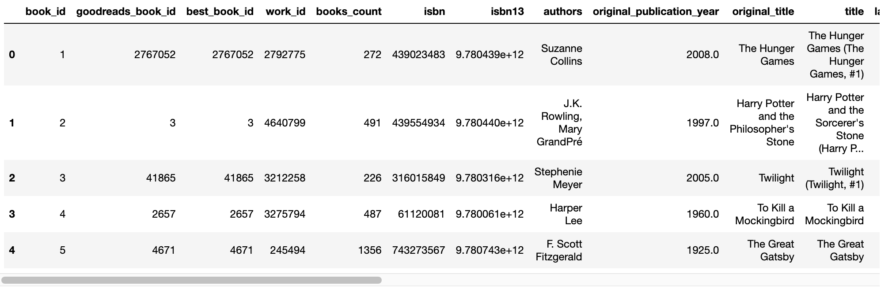
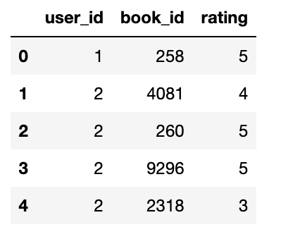
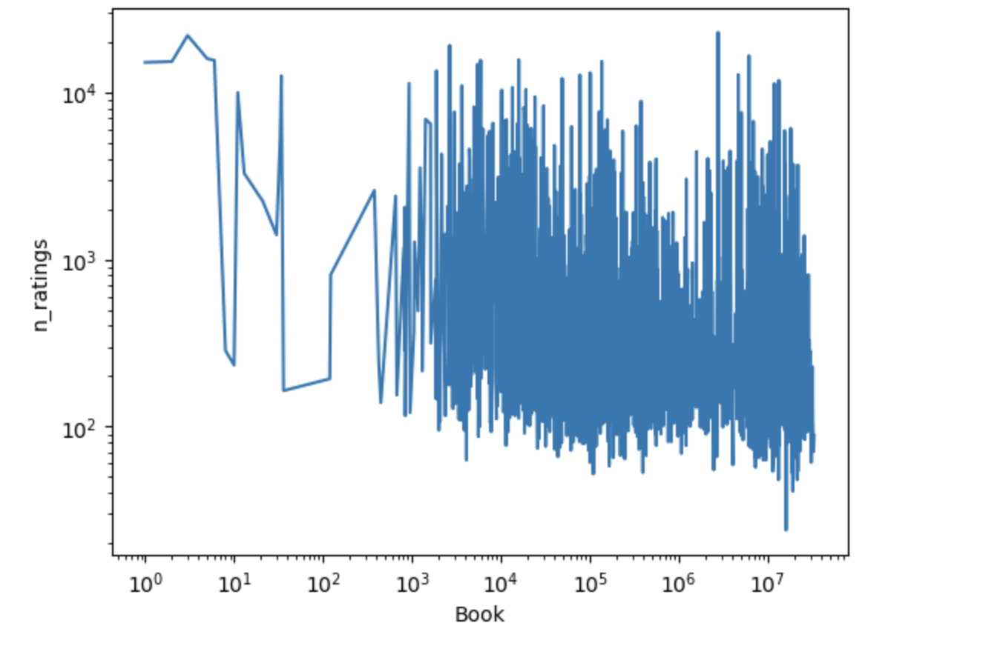
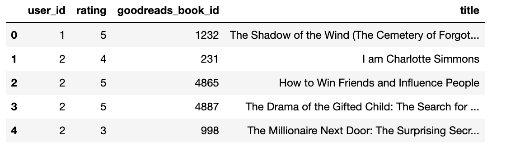
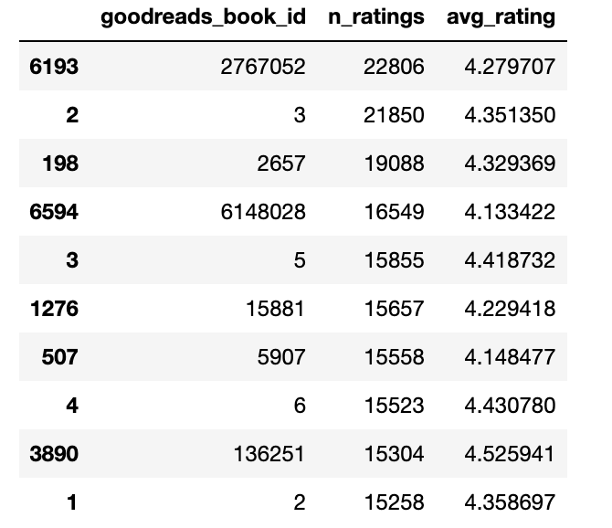
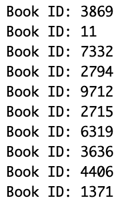
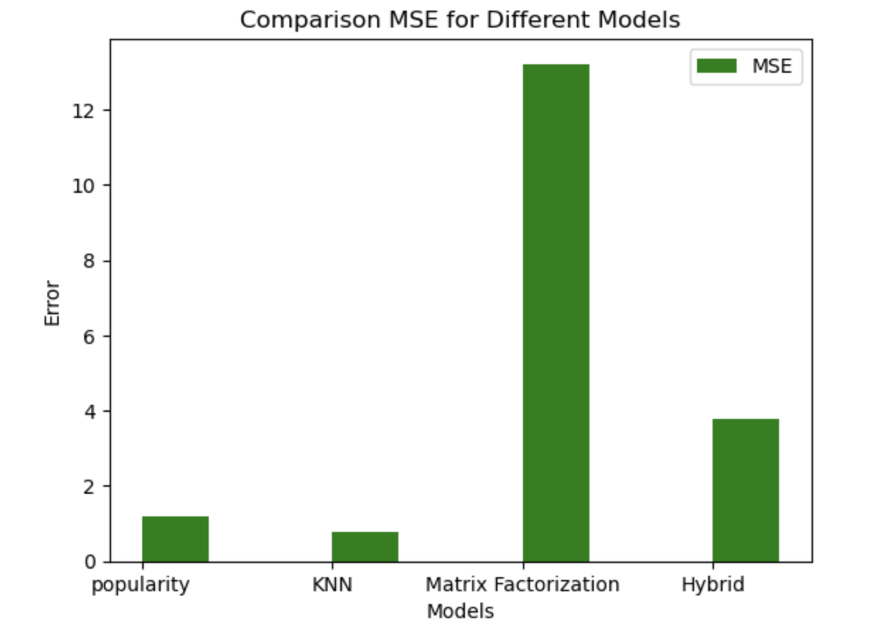

# Book Recommender System
**Eri Midorikawa** 

## Problem Statement
**User Story: Book Recommendation System for Avid Readers**

**As a** passionate book lover,

**I want** a reliable book recommender system that can help me discover new books based on my preferences,

**So that** I can continue enjoying my reading journey with fresh and exciting books.

**Acceptance Criteria:**

1. **Rating Books**
   - The system will consider my ratings when generating recommendations.

2. **Receiving Recommendations**
   - Recommendations should be based on my reading history, genre preferences, and author preferences.
   
3. **Rating Recommended Books**
   - The system will use my ratings to fine-tune future recommendations.

4. **Evaluation**
   - The system should aim to provide recommendations that I rate positively.

## Data Description 

The [Goodreads Dataset -10k](https://fastml.com/goodbooks-10k-a-new-dataset-for-book-recommendations/) seem to provide an collection of data about books ratings.

**- books.csv(10000, 23)** 
***book_id***: book id in this dataset 
***goodreads_book_id:*** book id　in goodreads system 
***best_book_id:*** book id in goodreads system with the most popular edition 
***work_id:*** Abstract book id 
***books_count*** 
***isbn:*** ISBN number 
***isbn13:*** ISBN-13 number 
***authors*** 
***original_publication_year***  
***original_title***  
***title*** 
***language_code*** 
***average_rating*** 
***ratings_count:*** The number of ratings 
***work_ratings_count:***　The number of ratings for all editions 
***work_text_reviews_count:*** The number of test ratings 
***ratings_1:*** The number of ratings (1) 
***ratings_2:*** The number of ratings (2) 
***ratings_3:*** The number of ratings (3) 
***ratings_4:*** The number of ratings (4) 
***ratings_5:*** The number of ratings (5) 
***image_url:*** Cover image 
***small_image_url:*** Small cover image  

**ratings.csv(5976479, 3)** 
***user_id*** 
***book_id*** 
***rating***  

### Exploratory Data Analysis 
This graoh visualize number of ratings for each books

### Data Preprocessing 
For ratings data, I changed book_id to "goodreads_book_id" since it will be easier to process genre tags in this way. This is the sample of pre-processed data. Also added the title column to convert book_id to title:

## algorithms
Using MSE to evaluate all models.

**Popurality**
- Popularity-based recommendation serves as a baseline approach. It recommends items based on their overall popularity, assuming that popular items are more likely to be of interest to users. This method is simple, interpretable, and can be effective for new users or in scenarios with limited user-item interaction data.

**Cosine Similarity**
- Make a user-item matrix from the provided ratings data and converting it into a NumPy array to compute cosine similarity matrix. The cosine similarity matrix captures the similarity between users in terms of their item preferences. The recommender system function, utilizing cosine similarity, generates personalized recommendations for a specified user. It provides a list of top 10 recommended items.

**Collaborative filtering using KNN** 
- Collaborative Filtering methods consider user behavior and preferences to identify similar users or items. K-nearest neighbors is chosen for its simplicity and effectiveness in capturing user-item interactions. By identifying users with similar preferences, the system can recommend items that similar users have liked. KNN is particularly useful in scenarios where users exhibit similar behavior.

**Matrix Factorization**
- Matrix factorization in recommender systems involves decomposing a user-item interaction matrix into user and item matrices based on latent factors. These factors capture underlying patterns in user preferences and item characteristics. The product of these matrices approximates the original interaction matrix, enabling the prediction of missing ratings. In this recommender, get 10 highest ratings from the predictions and make them as recommendation for the user.

**Hybrid of KNN, Cosine Similarity, and Matrix Factorization**
- It is a collaborative filtering recommender system that combines two different recommendation algorithms: k-Nearest Neighbors (k-NN) and Matrix Factorization (MF). It initializes with two models, a k-NN model (knn) and a Matrix Factorization model (mf), along with an empty list (hybrid_pred) to store hybrid predictions. It recommends books to a user based on the hybrid predictions. It identifies items that the user has not interacted with in the training set, sorts them based on hybrid predictions, and returns the top 10 recommendations.

## Experiments 
Getting 10 recommendations for user_id = 2

### Popularity
- Generate 10 most popular books based on the number of ratings and average ratings. If the average ratings are below 4.0, they are not going to be included. This allows that "books everyone hate/not liking"
Using MSE to evaluate this algorithm. This algorithm doesn't predict ratings directly, I used the average ratings as prediction to evaluate MSE.

### Collaborative filtering using KNN
- KNN model predicts user ratings based on ratings of users obtained by KNN. It Gets 10 highest ratings from predictions to provide recommendations. This model does better jobs in terms of MSE.

### Matrix Factorization
- Matirix Factorization also predicts user ratings using the dot product of a user matrix and item matrix. Again, this model also provides 10 highest predictions as recommendations. This model had very high MSE compare to other models.

### Hybrid Model
- Hybrid model is the hybrid of KNN and matrix factorization with even weight. Recomendations will be provided by 10 highest ratings from predictions

### Conclusion based on the experiments
The image below indicate MSE of each model:

## Reflection 
- Many of my attemps ended up not working since my computer and google colab crash to process the data. First, I was going to use original data which includes variety more data such as ratings and interaction for each genres. However, each table of dataset have big size 5 GB or more, therefore neither my computer nor Google Colab could even just read these data. Therefore, I ended up using smaller and simpler version of GoodReads dataset. However, even using smaller dataset, it also caused problem to pre-process this data. For example, I attempted to use content-based filtering using genre tags, but I failed to conbine all genres of a book into one rows since both my computer and Google Collab crash. Therefore, I could not use any methods using genres tags. It limited to complete me my first plan of this projects. I decided to use variety methods without using content-based algorithm. I implemented 3 basic recommender algorithm which are popularity, KNN, and matirix factorization, then I conbine 2 of the algorithms (KNN, MF). I also attempted to add cosine similarity for the basic algorithms, however, it failed to calculate MSE due to crashing. Therefore, cosine similarity was excluded to the final submission.

- Popularity recommender had high MSE as I expected because popularity does not refer user's prefarances at all. Matrix Factorization had the worst MSE. It caused possibly by orverfitting. I couldn't tune hyperparameter of MF model due to time limitation. Hybrid models improved compared to MF. This might be caused by using with KNN. It might improve more if I weghit KNN more than MF.

- I had hard time to process my dataset because my computer and google colab kept crashing. In future class, it might be good to have detail guidance for choosing dataset, or having variety of default datasets for the class project. It will also be good to have other choices other than Google Colab in case Google Colab didn't work.